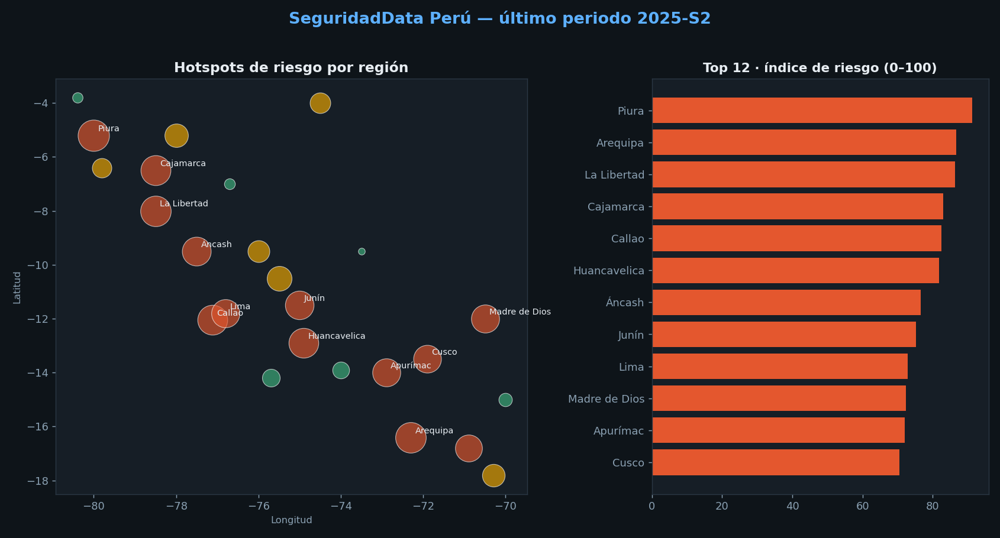

# 🛡️ SecData Perú

**Tablero dinámico de seguridad ciudadana: hotspots de riesgo por región, alimentado con datos públicos y pensado para la toma de decisiones.**

> No es un mapa decorativo: es un **semáforo de riesgo** que ayuda a priorizar dónde concentrar patrullaje, presupuesto o intervención. Combina victimización, homicidios y percepción de inseguridad en un índice por región y permite recorrer su evolución en el tiempo.



🔗 **Página en vivo (GitHub Pages):** `https://oprbguitar.github.io/SecData-peru/`

---

## ¿De qué trata?

SecData Perú toma información **pública y agregada** de seguridad ciudadana y la convierte en un tablero único, claro y accionable. En lugar de revisar boletines sueltos, el usuario ve de un vistazo **qué regiones están peor, hacia dónde van y dónde actuar primero**.

La página interactiva muestra:

- **Mapa de hotspots** por región: el tamaño del círculo refleja el índice de riesgo y el color el semáforo (Alto / Medio / Bajo).
- **Línea de tiempo con reproducción automática**: un botón “play” anima la evolución del riesgo a lo largo de los periodos disponibles.
- **Indicadores clave (KPIs)**: victimización promedio nacional, región de mayor riesgo y número de regiones en nivel Alto.
- **Ranking de regiones** por índice de riesgo, con clic para ver su tendencia.
- **Gráfico de tendencia** de victimización, nacional o por región seleccionada.

## Índice de riesgo (la lógica de decisión)

Cada región recibe un índice de **0 a 100** que combina, con pesos configurables:

- Tasa de victimización (45 %)
- Tasa de homicidios (35 %)
- Percepción de inseguridad (20 %)

Sobre ese resultado se aplica un **semáforo** (Alto / Medio / Bajo) para una lectura inmediata orientada a la priorización de recursos.

## Fuentes de los datos

La información proviene de fuentes **públicas y oficiales** del Estado peruano, trabajada siempre de forma **agregada por región** (nunca a nivel de persona):

- **Instituto Nacional de Estadística e Informática (INEI)** — sistema integrado de estadísticas de criminalidad y seguridad ciudadana, encuesta de victimización y sistema de información regional.
- **Observatorio Nacional de Seguridad Ciudadana (OBNASEC) — Ministerio del Interior.**

> *Cadencia:* la victimización es **semestral**, no en vivo minuto a minuto. La “actualización en tiempo real” del proyecto consiste en **refrescar de forma programada el último dato publicado**. Para que el repositorio funcione siempre (incluso sin conexión), incluye una **muestra sintética** de demostración; los resultados mostrados con esa muestra **no representan cifras reales**.

## Cómo está construido

```
Fuente pública ─► ingest ─► transform (índice + semáforo) ─► build_web ─► docs/data.json
                                                                  │
                                                                  ├─► docs/index.html  (GitHub Pages / local)
                                                                  └─► app/streamlit_app.py (local interactivo)
```

**Stack:** Python (pandas, numpy, requests, matplotlib) · Leaflet · Chart.js · Streamlit · GitHub Actions / Pages.

## Cómo ejecutarlo localmente

```bash
pip install -r requirements.txt

python -m src.run_pipeline            # genera los datos del tablero (modo muestra)
python -m src.run_pipeline --refresh  # intenta la fuente real configurada
python -m src.plot_preview            # imagen de vista previa

# Ver el tablero:
#   - dinámico:          abre docs/index.html (o publícalo en GitHub Pages)
#   - interactivo local: streamlit run app/streamlit_app.py
```

**Publicar la página:** en GitHub, *Settings → Pages → Source: rama `main`, carpeta `/docs`*. Queda disponible en `https://oprbguitar.github.io/SecData-peru/`.

**Actualización automática:** el flujo `.github/workflows/refresh.yml` ejecuta el pipeline de forma programada y vuelve a publicar el tablero.

## Limitaciones

- El mapa usa **centroides** de región (mapa de puntos); para coropletas exactas se puede añadir el límite geográfico oficial.
- Los umbrales del semáforo y los pesos del índice son **decisiones de política** y deben ajustarse al criterio de cada entidad.
- La victimización proviene de una encuesta (tiene margen de error); el índice es un **apoyo** a la decisión, no un veredicto.
- La muestra sintética sirve solo para demostración del funcionamiento.

## Confidencialidad

Proyecto **demostrativo**. Usa exclusivamente datos **públicos y agregados** y/o **sintéticos**. **No contiene información reservada, confidencial, datos personales ni información de empleadores actuales o anteriores.** Ver `docs/CONFIDENCIALIDAD.md`.

---

**Creado por Pierre R.** — Ingeniero Industrial · analítica institucional, geovisualización y automatización de datos.

📧 **Consultas adicionales:** [peru.labs.pe@gmail.com](mailto:peru.labs.pe@gmail.com)
